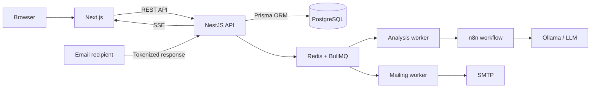

<div align="right">
  <a href="README.md">Русский</a> · <strong>English</strong>
</div>

<div align="center">
  
  <h1>Projectoria</h1>
  <p><strong>A platform supporting the initiation of university projects</strong></p>
  <p>From an unstructured customer request to analysis, routing, outreach, and response tracking.</p>
</div>

> Archived version of a University of Tyumen master's project completed in 2026. The repository is preserved as a demonstration of the product and its architecture.

## Overview

Projectoria automates the early stage of collaboration between a university and industrial customers. The platform accepts a written request or meeting transcript, enriches it with department competency data, runs LLM-assisted analysis, and helps organize the first communication with potential project participants.

Automation remains human-controlled: the LLM output is treated as a draft that an initiator reviews and edits before any messages are sent.

### Key features

- creation and storage of project requests;
- manual text entry, `.txt` upload, and conversation capture through the browser Speech Recognition API;
- asynchronous LLM analysis through configurable `mock`, `external`, or `n8n` providers;
- request decomposition and department matching based on competencies;
- editing recommendations, email drafts, and recipients before delivery;
- email delivery through SMTP or an optional n8n workflow;
- personalized tokenized links for accepting or declining participation;
- real-time response notifications through SSE;
- `ADMIN` and `INITIATOR` roles;
- an isolated demo mode that does not write to the main database.

## Interface

All screenshots contain demonstration data.

<table>
  <tr>
    <td width="72%"></td>
    <td width="28%"></td>
  </tr>
  <tr>
    <td align="center"><strong>Project registry</strong></td>
    <td align="center"><strong>Sign-in and demo mode</strong></td>
  </tr>
</table>

### Project creation and themes

<table>
  <tr>
    <td width="50%"></td>
    <td width="50%"></td>
  </tr>
  <tr>
    <td align="center"><strong>Light theme</strong></td>
    <td align="center"><strong>Dark theme</strong></td>
  </tr>
</table>

### Administration

<table>
  <tr>
    <td width="50%"></td>
    <td width="50%"></td>
  </tr>
  <tr>
    <td align="center"><strong>Users</strong></td>
    <td align="center"><strong>Departments</strong></td>
  </tr>
</table>

## Workflow

1. An initiator creates a project and provides the original request text.
2. The API enqueues the analysis in BullMQ and moves the project into processing.
3. The LLM receives the project text and the active department competency context.
4. The result is stored as a summary, a task list, and department recommendations.
5. The initiator reviews the recommendations, edits the messages, and selects recipients.
6. Emails are sent asynchronously through SMTP or n8n.
7. Recipients accept or decline participation through a personalized link.
8. The project author receives a notification, and the decision is saved in the project history.

## Architecture



The backend is implemented as a modular monolith. Long-running analysis and mailing operations are handled through background queues. LLM integration is separated from the core business logic through a provider interface and an n8n workflow.

### Technology stack

| Area | Technologies |
| --- | --- |
| Frontend | Next.js 15, React 19, TypeScript |
| Backend | NestJS 11, TypeScript |
| Data | PostgreSQL 16, Prisma ORM |
| Background jobs | Redis 7, BullMQ |
| LLM | n8n, Ollama, OpenAI-compatible external API |
| Email | Nodemailer, SMTP, optional n8n workflow |
| Authentication | bcrypt, JWT in an `httpOnly` cookie, CSRF double-submit |
| Infrastructure | Docker Compose, Caddy |

The source of truth for the data model is [`apps/api/prisma/schema.prisma`](apps/api/prisma/schema.prisma).

## Quick start with Docker

### Requirements

- Docker Engine or Docker Desktop;
- Docker Compose v2;
- available local ports `3000`, `3001`, `5678`, `11434`, `80`, and `443`.

### 1. Configure the environment

```bash
cp .env.example .env
```

Replace at least these values before starting the application:

```env
JWT_ACCESS_SECRET=replace_with_a_long_random_secret
SEED_ADMIN_EMAIL=admin@example.com
SEED_ADMIN_PASSWORD=change_me_before_use
SEED_ADMIN_NAME=Administrator
```

`LLM_PROVIDER=mock` is used by default, so an external model is not required to explore the interface.

### 2. Start the stack

```bash
docker compose up --build -d
```

After startup:

- application: [http://localhost:3000](http://localhost:3000);
- API health check: [http://localhost:3001/health](http://localhost:3001/health);
- n8n: [http://localhost:5678](http://localhost:5678);
- Ollama API: [http://localhost:11434](http://localhost:11434).

Check the services:

```bash
docker compose ps
curl http://localhost:3001/health
```

Stop the stack:

```bash
docker compose down
```

To remove local PostgreSQL, Redis, n8n, and Ollama data, use `docker compose down -v`. This command permanently deletes the project Docker volumes.

## LLM integration with n8n and Ollama

The current workflow is stored in [`docs/n8n/workflows/Main.json`](docs/n8n/workflows/Main.json).

1. Open n8n at `http://localhost:5678`.
2. Import `Main.json` and activate the workflow.
3. Install a compatible model in Ollama.
4. Configure `.env`:

```env
LLM_PROVIDER=n8n
LLM_MODEL=qwen3.6:35b
OLLAMA_BASE_URL=http://ollama:11434
N8N_LLM_WEBHOOK_URL=http://n8n:5678/webhook/llm-analyze
N8N_OLLAMA_PROXY_CHAT_URL=http://api:3001/internal/ollama/api/chat
N8N_LLM_TIMEOUT_MS=1800000
```

Example model installation in the local container:

```bash
docker exec projectoria-ollama ollama pull qwen3.6:35b
```

When using another model, use the same name in `LLM_MODEL` and in the Ollama pull command. For a remote LLM server, replace `OLLAMA_BASE_URL`; VPN and routing configuration remain the responsibility of the deployment environment.

### Expected LLM response

```json
{
  "summary": "Short request summary",
  "tasks": [
    {
      "title": "Task title",
      "description": "Task description",
      "priority": "high"
    }
  ],
  "departmentSuggestions": [
    {
      "departmentCode": "DEPARTMENT_CODE",
      "relevanceReason": "Why the department is relevant",
      "problemFragment": "Related request fragment",
      "adaptedPitch": "Suggested area of participation",
      "emailSubject": "Email subject",
      "emailBody": "Email draft"
    }
  ]
}
```

## SMTP

Configure these variables for real email delivery:

```env
SMTP_HOST=smtp.example.com
SMTP_PORT=465
SMTP_SECURE=true
SMTP_USER=user@example.com
SMTP_PASS=application_password
SMTP_FROM="Projectoria <user@example.com>"
```

When `N8N_EMAIL_WORKFLOW_URL` is configured, the application attempts to use the n8n workflow first. Otherwise, it sends email through Nodemailer and SMTP.

## Local development without Docker

Node.js 20+, PostgreSQL 16+, and Redis 7+ are required.

```bash
npm install
cp .env.example .env
npm run prisma:generate --workspace=apps/api
npm run prisma:deploy --workspace=apps/api
npm run seed --workspace=apps/api
npm run dev
```

The frontend starts at `http://localhost:3000`, and the API starts at `http://localhost:3001`.

## Validation

```bash
npm run test
npm run lint
npm run build
```

The backend includes unit tests for authentication, projects, and public responses.

## Repository structure

```text
.
├── apps
│   ├── api                 # NestJS API, Prisma, queues, and integrations
│   └── web                 # Next.js interface
├── deploy
│   └── Caddyfile           # Reverse proxy and HTTPS
├── docs
│   ├── n8n/workflows       # Importable LLM workflow
│   └── screenshots         # README interface screenshots
├── docker-compose.yml
├── .env.example
├── README.md
└── README.en.md
```

## Security

The project implements bcrypt password hashing, JWT in an `httpOnly` cookie, CSRF double-submit, role-based access control, DTO validation, and rate limiting for public endpoints.

For a public deployment:

- replace every placeholder value in `.env`;
- use HTTPS and a long random `JWT_ACCESS_SECRET`;
- never expose PostgreSQL, Redis, n8n, or Ollama directly to the Internet;
- restrict external access to the internal Ollama proxy;
- configure backups, monitoring, and a personal data processing policy.

## Project status

Development is complete. This repository is archived and is not expected to receive regular maintenance, but it can be used as a foundation for further development or as an architecture reference.
