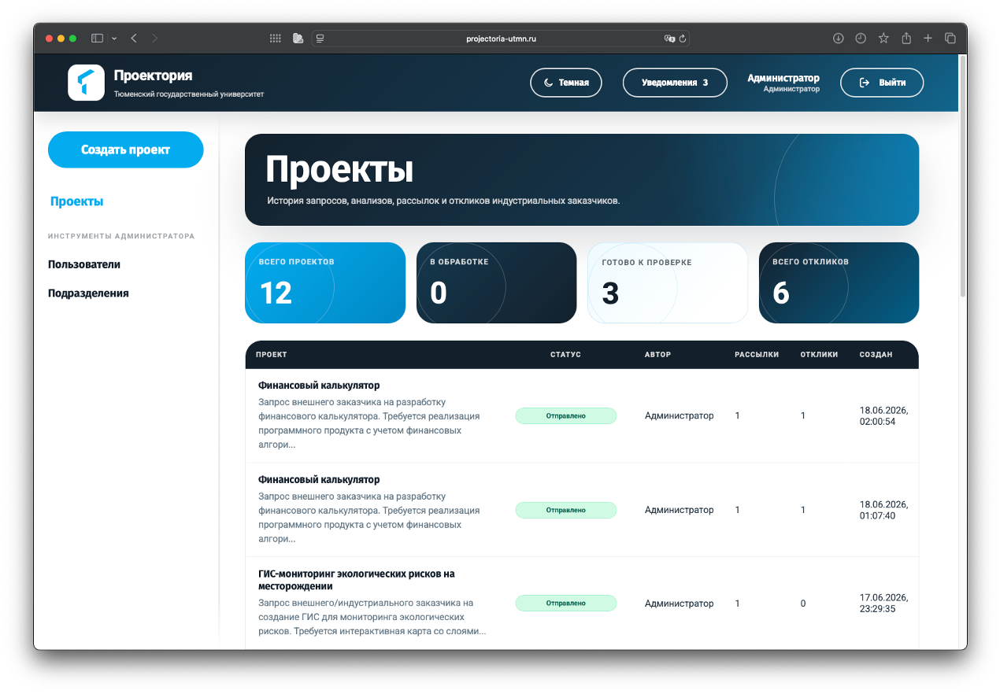
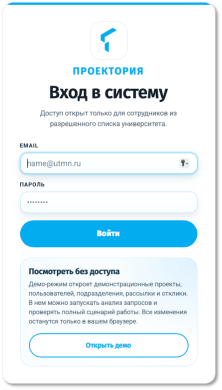
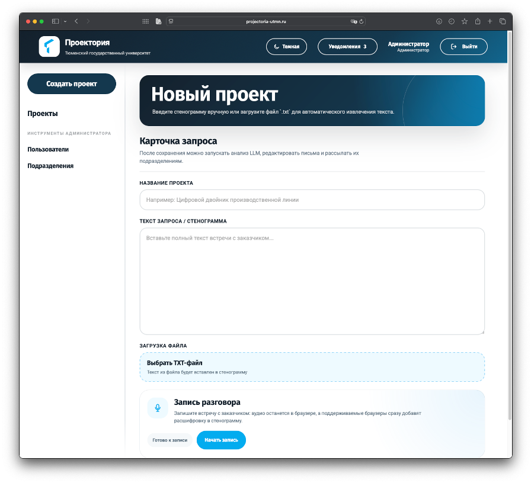
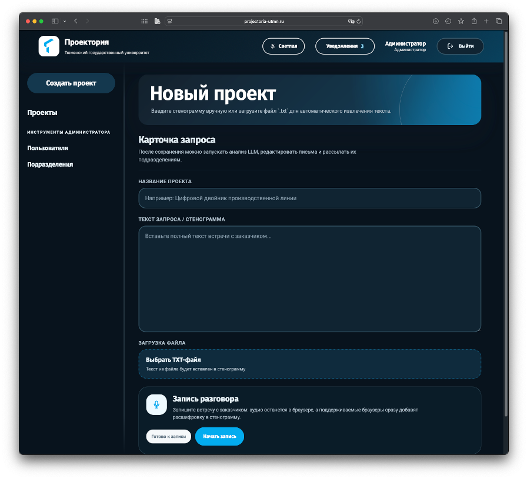
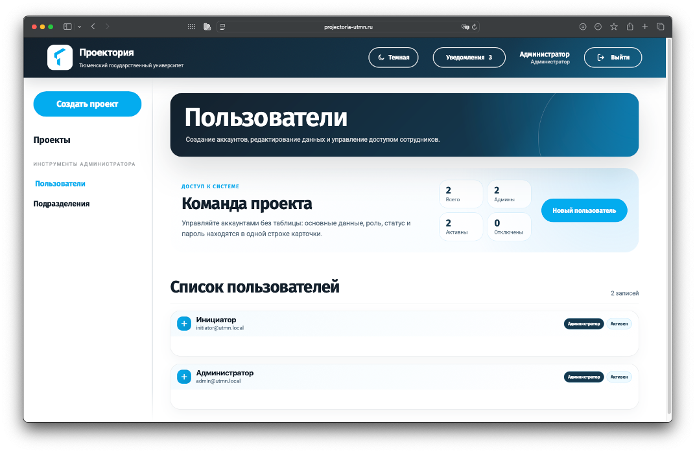
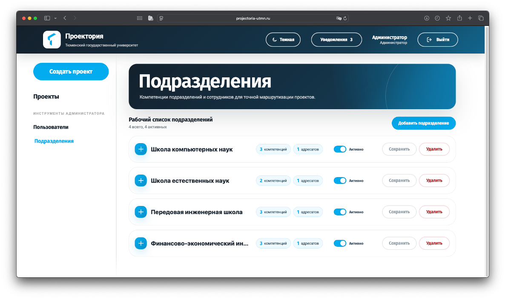
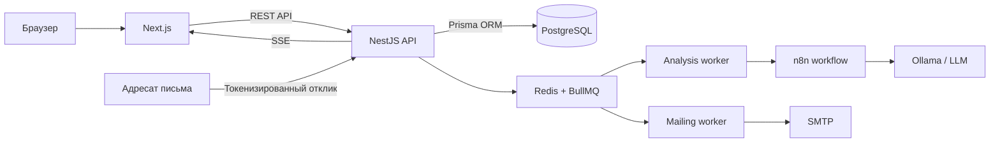

<div align="right">
  <strong>Русский</strong> · <a href="README.en.md">English</a>
</div>

<div align="center">
  
  <h1>Проектория</h1>
  <p><strong>Платформа поддержки инициации университетских проектов</strong></p>
  <p>От неструктурированного запроса заказчика до анализа, маршрутизации, рассылки и сбора откликов.</p>
</div>

> Архивная версия магистерского проекта Тюменского государственного университета, завершенного в 2026 году. Репозиторий сохранен как демонстрация архитектуры и реализованного продукта.

## О проекте

«Проектория» автоматизирует раннюю стадию взаимодействия университета с индустриальными заказчиками. Платформа принимает текст заявки или стенограмму разговора, дополняет его сведениями о компетенциях подразделений, запускает LLM-анализ и помогает организовать первичную коммуникацию с потенциальными участниками проекта.

Автоматизация остается контролируемой: результат LLM используется как черновик, который инициатор проверяет и редактирует перед отправкой.

### Основные возможности

- создание и хранение проектных запросов;
- ввод текста вручную, загрузка `.txt` и запись разговора через браузерный Speech Recognition API;
- асинхронный LLM-анализ через настраиваемые провайдеры `mock`, `external` или `n8n`;
- декомпозиция запроса и подбор подразделений по компетенциям;
- редактирование рекомендаций, писем и адресатов перед рассылкой;
- отправка писем через SMTP или n8n workflow;
- персональные токенизированные ссылки для принятия или отклонения участия;
- уведомления об откликах в реальном времени через SSE;
- роли `ADMIN` и `INITIATOR`;
- изолированный демонстрационный режим без записи в основную базу.

## Интерфейс

Все изображения содержат демонстрационные данные.

<table>
  <tr>
    <td width="72%"></td>
    <td width="28%"></td>
  </tr>
  <tr>
    <td align="center"><strong>Реестр проектов</strong></td>
    <td align="center"><strong>Вход и демо-режим</strong></td>
  </tr>
</table>

### Создание проекта и темы оформления

<table>
  <tr>
    <td width="50%"></td>
    <td width="50%"></td>
  </tr>
  <tr>
    <td align="center"><strong>Светлая тема</strong></td>
    <td align="center"><strong>Темная тема</strong></td>
  </tr>
</table>

### Администрирование

<table>
  <tr>
    <td width="50%"></td>
    <td width="50%"></td>
  </tr>
  <tr>
    <td align="center"><strong>Пользователи</strong></td>
    <td align="center"><strong>Подразделения</strong></td>
  </tr>
</table>

## Сценарий работы

1. Инициатор создает проект и добавляет исходный текст заявки.
2. API ставит анализ в очередь BullMQ и переводит проект в обработку.
3. LLM получает текст проекта и контекст активных подразделений с их компетенциями.
4. Результат сохраняется как сводка, набор задач и рекомендации по подразделениям.
5. Инициатор проверяет рекомендации, редактирует письма и выбирает адресатов.
6. Письма отправляются в фоне через SMTP или n8n.
7. Адресаты принимают или отклоняют участие по персональной ссылке.
8. Автор проекта получает уведомление, а решение сохраняется в истории проекта.

## Архитектура



Backend реализован как модульный монолит. Длительные операции анализа и рассылки вынесены в фоновые очереди, а интеграционная логика LLM отделена от основной бизнес-логики через provider-интерфейс и n8n workflow.

### Технологии

| Контур | Технологии |
| --- | --- |
| Frontend | Next.js 15, React 19, TypeScript |
| Backend | NestJS 11, TypeScript |
| Данные | PostgreSQL 16, Prisma ORM |
| Фоновые задачи | Redis 7, BullMQ |
| LLM | n8n, Ollama, OpenAI-compatible external API |
| Почта | Nodemailer, SMTP, optional n8n workflow |
| Авторизация | bcrypt, JWT в `httpOnly` cookie, CSRF double-submit |
| Инфраструктура | Docker Compose, Caddy |

Источник истины для модели данных: [`apps/api/prisma/schema.prisma`](apps/api/prisma/schema.prisma).

## Быстрый запуск через Docker

### Требования

- Docker Engine или Docker Desktop;
- Docker Compose v2;
- свободные локальные порты `3000`, `3001`, `5678`, `11434`, `80` и `443`.

### 1. Настройка окружения

```bash
cp .env.example .env
```

Обязательно замените перед запуском:

```env
JWT_ACCESS_SECRET=replace_with_a_long_random_secret
SEED_ADMIN_EMAIL=admin@example.com
SEED_ADMIN_PASSWORD=change_me_before_use
SEED_ADMIN_NAME=Администратор
```

По умолчанию используется `LLM_PROVIDER=mock`, поэтому для знакомства с интерфейсом внешняя модель не требуется.

### 2. Запуск

```bash
docker compose up --build -d
```

После запуска:

- приложение: [http://localhost:3000](http://localhost:3000);
- API health check: [http://localhost:3001/health](http://localhost:3001/health);
- n8n: [http://localhost:5678](http://localhost:5678);
- Ollama API: [http://localhost:11434](http://localhost:11434).

Проверка контейнеров:

```bash
docker compose ps
curl http://localhost:3001/health
```

Остановка:

```bash
docker compose down
```

Для удаления локальных данных PostgreSQL, Redis, n8n и Ollama используйте `docker compose down -v`. Эта команда необратимо удаляет Docker volumes проекта.

## Подключение LLM через n8n и Ollama

Актуальный workflow находится в [`docs/n8n/workflows/Main.json`](docs/n8n/workflows/Main.json).

1. Откройте n8n на `http://localhost:5678`.
2. Импортируйте `Main.json` и активируйте workflow.
3. Установите совместимую модель в Ollama.
4. Настройте `.env`:

```env
LLM_PROVIDER=n8n
LLM_MODEL=qwen3.6:35b
OLLAMA_BASE_URL=http://ollama:11434
N8N_LLM_WEBHOOK_URL=http://n8n:5678/webhook/llm-analyze
N8N_OLLAMA_PROXY_CHAT_URL=http://api:3001/internal/ollama/api/chat
N8N_LLM_TIMEOUT_MS=1800000
```

Пример загрузки модели в локальный контейнер:

```bash
docker exec projectoria-ollama ollama pull qwen3.6:35b
```

Если используется другая модель, укажите одинаковое имя в `LLM_MODEL` и при загрузке в Ollama. Для удаленного LLM-сервера замените `OLLAMA_BASE_URL`; организация VPN и маршрутизации остается ответственностью среды развертывания.

### Структура ответа LLM

```json
{
  "summary": "Краткая сводка запроса",
  "tasks": [
    {
      "title": "Название задачи",
      "description": "Описание задачи",
      "priority": "high"
    }
  ],
  "departmentSuggestions": [
    {
      "departmentCode": "DEPARTMENT_CODE",
      "relevanceReason": "Почему подразделение релевантно",
      "problemFragment": "Связанный фрагмент запроса",
      "adaptedPitch": "Предлагаемая зона участия",
      "emailSubject": "Тема письма",
      "emailBody": "Черновик письма"
    }
  ]
}
```

## SMTP

Для реальной отправки писем заполните:

```env
SMTP_HOST=smtp.example.com
SMTP_PORT=465
SMTP_SECURE=true
SMTP_USER=user@example.com
SMTP_PASS=application_password
SMTP_FROM="Проектория <user@example.com>"
```

Если задан `N8N_EMAIL_WORKFLOW_URL`, приложение сначала использует n8n workflow. При отсутствии workflow применяется SMTP через Nodemailer.

## Локальная разработка без Docker

Нужны Node.js 20+, PostgreSQL 16+ и Redis 7+.

```bash
npm install
cp .env.example .env
npm run prisma:generate --workspace=apps/api
npm run prisma:deploy --workspace=apps/api
npm run seed --workspace=apps/api
npm run dev
```

Frontend запускается на `http://localhost:3000`, API — на `http://localhost:3001`.

## Проверки

```bash
npm run test
npm run lint
npm run build
```

Backend содержит модульные тесты для авторизации, проектов и публичных откликов.

## Структура репозитория

```text
.
├── apps
│   ├── api                 # NestJS API, Prisma, очереди и интеграции
│   └── web                 # Next.js интерфейс
├── deploy
│   └── Caddyfile           # Reverse proxy и HTTPS
├── docs
│   ├── n8n/workflows       # Экспортируемый LLM workflow
│   └── screenshots         # Изображения интерфейса для README
├── docker-compose.yml
├── .env.example
├── README.md
└── README.en.md
```

## Безопасность

В проекте реализованы хеширование паролей bcrypt, JWT в `httpOnly` cookie, CSRF double-submit, ролевая модель доступа, DTO-валидация и ограничение запросов к публичным endpoints.

Для публичного развертывания необходимо:

- заменить все значения-заглушки в `.env`;
- использовать HTTPS и длинный случайный `JWT_ACCESS_SECRET`;
- не публиковать PostgreSQL, Redis, n8n и Ollama напрямую в интернет;
- ограничить внешний доступ к внутреннему Ollama proxy;
- настроить резервное копирование, мониторинг и регламент обработки персональных данных.

## Статус проекта

Разработка завершена. Репозиторий находится в архивном режиме и не предполагает регулярной поддержки, но может использоваться как основа для дальнейшего развития или изучения архитектуры платформы.
